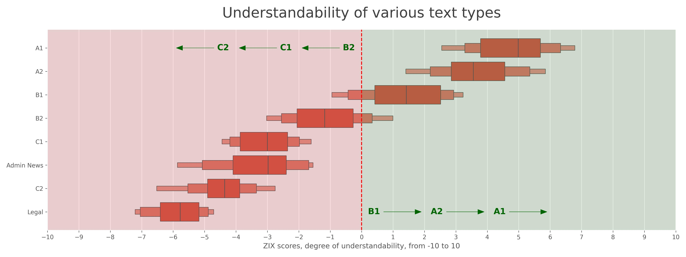
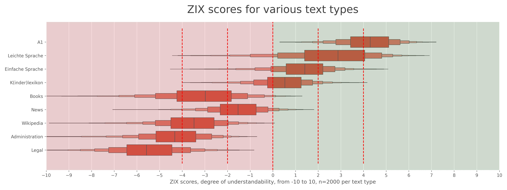

# Zürcher Verständlichkeitsindex (ZIX)

**Get a pragmatic indication of how understandable a German text is.**


[](https://github.com/machinelearningZH/zix_understandability-index/stargazers)
[](https://github.com/machinelearningZH/zix_understandability-index/issues)
[](https://img.shields.io/github/issues-pr/machinelearningZH/zix_understandability-index)
[](https://github.com/machinelearningZH/zix_understandability-index)
<a href="https://github.com/astral-sh/ruff"></a>

<details>
<summary>Contents</summary>

- [Usage](#usage)
- [What does the score mean?](#what-does-the-score-mean)
- [How does the score work?](#how-does-the-score-work)
- [Background](#background)
- [Project team](#project-team)
- [Feedback and contributing](#feedback-and-contributing)
- [License](#license)
- [Disclaimer](#disclaimer)

</details>

## Usage

[Install uv](https://docs.astral.sh/uv/getting-started/installation/) for environment management.

**1. Install ZIX as a package**

- Install directly from GitHub: `pip install git+https://github.com/machinelearningZH/zix_understandability-index`
- Or clone the repo and install locally: `pip install .`
- The required spaCy language model (`de_core_news_sm`) is installed automatically.
- Use the package as follows:

```python
from zix.understandability import get_zix, get_cefr

text = """
Die Schweiz, amtlich Schweizerische Eidgenossenschaft, ist ein föderalistischer, demokratischer Staat in Mitteleuropa. Er grenzt im Norden an Deutschland, im Osten an Österreich und Liechtenstein, im Süden an Italien und im Westen an Frankreich.
""".strip()
zix_score = get_zix(text)
cefr = get_cefr(zix_score)
print(f"The text has a ZIX understandability score of: {zix_score:.1f}")
print(f"The text has a CEFR level of roughly: {cefr}")

>>> The text has a ZIX understandability score of: -2.0
>>> The text has a CEFR level of roughly: C1
```

**2. Explore the methodology in the notebooks**

- Clone this repo and change into the project directory.
- Set up the environment with notebook dependencies: `uv sync --extra notebooks`
- Run the notebooks in an IDE such as [Visual Studio Code](https://code.visualstudio.com/), [Jupyter Notebook](https://docs.jupyter.org/en/latest/running.html), or [Jupyter Lab](https://jupyter.org/install).
- To recreate the synthetic data generated with LLMs, create an `.env` file with your [OpenRouter API key](https://openrouter.ai/settings/keys):

```
    OPENROUTER_API_KEY=sk-...
```

## What does the score mean?

- **Negative scores indicate difficult texts in the B2 to C2 range**. These texts will likely be **very hard for many people to understand** (classic «Behördendeutsch» or legal text territory).
- **Positive scores indicate a language level of B1 or easier**.

The plot below shows the scores for our own data set.


With the ZIX metric, we can also assess other corpora and text types.


> [!Important]
> This understandability index is a **pragmatic measure**. It is **neither exact nor an official CEFR-level measure**. That said, **the index works well in practice** in our context and for our text data. We treat it as an **indication** of whether our editing is moving in the right direction.

Please note that **this index only works for German texts!** It is also designed for **paragraphs of text**. For very short texts (e.g. single words or short phrases), the estimate will not be reliable.

## How does the score work?

- The score accounts for sentence length, the [RIX readability metric](https://hlasse.github.io/TextDescriptives/readability.html), the occurrence of common words, and overlap with standard CEFR vocabularies for A1, A2, and B1.
- At the moment, the score does **not** account for other language properties that are essential for [Einfache Sprache](https://de.wikipedia.org/wiki/Einfache_Sprache) (B1 or easier, similar to «Plain English») or [Leichte Sprache](https://de.wikipedia.org/wiki/Leichte_Sprache) (A2/A1, similar to «Easy English»), such as passive voice, subjunctives, negations, etc.

**For more details on how we derived the index, see the notebooks**, especially `04_create_zix.ipynb`.

> [!Note]
> The index is slightly adjusted to Swiss German. Specifically, we use `ss` instead of `ß` in our vocabulary lists. In practice, this should not make a big difference. For High German text that contains `ß`, the index will likely underestimate understandability slightly, with a difference of around 0.1.

## Background

Since no open **understandability** index seems to be available, we created our own. Many _readability_ metrics exist, but readability and understandability are related, not identical: a text can be readable yet hard to understand because of difficult vocabulary, passive voice, subjunctives, etc.

**Our index goes beyond readability metrics by incorporating semantic features**, with an emphasis on common vocabulary. It also measures overlap between the text's vocabulary and standard German [CEFR](https://www.coe.int/en/web/common-european-framework-reference-languages) vocabularies.

We recommend systematically validating the index with your own text data to assess whether it works well for your domain.

### Our steps to create the index

**1. Data Collection** ([01_create_cefr_data.ipynb](01_create_cefr_data.ipynb), [02_scrape_administrative_texts.ipynb](02_scrape_administrative_texts.ipynb))

- Generate synthetic text samples for CEFR language levels A1 to C2 using 10 LLMs via OpenRouter (Gemini Flash Lite/Flash/Pro, Claude Haiku/Sonnet/Opus, GPT-5 mini/5.1/5.2, Mistral Large).
- Scrape [news bulletins from the cantonal administration](https://www.zh.ch/de/news-uebersicht.html) as C1-level references.
- Use [legal decisions from a cantonal court](https://www.baurekursgericht-zh.ch/) as C2+ references.
- Incorporate official CEFR vocabularies for A1, A2, and B1 from the [Goethe Institut](https://www.goethe.de/de/index.html).
- Use a word frequency list of the most common words in German.

**2. Dataset Creation** ([03_create_dataset.ipynb](03_create_dataset.ipynb))

- Combine synthetic CEFR samples, administrative news, and legal texts.
- Prepare standard CEFR vocabulary reference lists (lemmatized).
- Create a unified dataset for model training.

**3. Index Development** ([04_create_zix.ipynb](04_create_zix.ipynb))

- Extract linguistic features and readability metrics with [spaCy](https://spacy.io/) and [textdescriptives](https://github.com/HLasse/TextDescriptives).
- Calculate CEFR vocabulary overlap (A1, A2, B1) and common word scores.
- Explore feature distributions across text types.
- Use a Gaussian Mixture Model to identify and filter outliers.
- Select 6 expressive features (2 syntactic, 4 semantic): sentence length, RIX readability, CEFR vocabulary ratios, and common word score.
- Map text types to difficulty levels (A1=1, A2=2, B1=3, B2=4, C1/Admin=5, C2=6, Legal=8).
- Train a Ridge Regressor with cross-validation on the difficulty levels.
- Scale predicted scores to a -10 to 10 range, centered around 0.
- Negative scores indicate difficult texts (B2 to C2); positive scores indicate simpler texts (B1 to A1).
- Serialize the trained model and scaler for the package.

**4. Package Creation**

- Refactor the index into a reusable module.
- Include the trained model, scaler, and reference vocabularies.
- Make it installable via pip.

We developed this index [for our text simplification app](https://github.com/machinelearningZH/simply-simplify-language), which helps us rewrite complex administrative texts. The app displays the understandability of both the source text and the simplified text. The index also allows us to measure the quality of various prompting techniques and methods quantitatively.

To the best of our knowledge, there are no open-source CEFR-labeled NLP datasets with a truly permissive license. Most available general datasets (Wikipedia, books, news sources, etc.) are either paid or have licensing that is too restrictive for our use case. Therefore, we use text data from the cantonal administration and create additional synthetic data.

## Project Team

**Chantal Amrhein**, **Patrick Arnecke** – [Statistisches Amt Zürich: Team Data](https://www.zh.ch/de/direktion-der-justiz-und-des-innern/statistisches-amt/data.html)

## Feedback and Contributing

We welcome feedback and contributions! [Email us](mailto:datashop@statistik.zh.ch) or open an issue or pull request.

We use [`ruff`](https://docs.astral.sh/ruff/) for linting and formatting.

To run tests:

- Install dev dependencies: `uv sync --extra dev`
- Run tests: `uv run pytest _tests/`

## License

This project is licensed under the MIT License. See the [LICENSE](LICENSE) file for details.

Please be aware that the text data from the cantonal administration (court decisions, news bulletins, RRBs) is copyrighted and therefore **not** included in the MIT license. This does not affect your use of the index. You just should not use the cantonal text data for anything else.

## Disclaimer

This software (the Software) incorporates commercial and open-source models (the Models) from providers and libraries such as OpenRouter, spaCy, etc. The app was developed according to Swiss law and with the intent to be used under Swiss law. Please be aware that the EU Artificial Intelligence Act (EU AI Act) may, under certain circumstances, apply to your use of the Software. You are solely responsible for ensuring that your use of the Software and the underlying Models complies with all applicable local, national, and international laws and regulations. By using this Software, you acknowledge and agree (a) that it is your responsibility to assess which laws and regulations, in particular regarding the use of AI technologies, apply to your intended use and to comply with them, and (b) that you will hold us harmless from any action, claims, liability, or loss in respect of your use of the Software.
