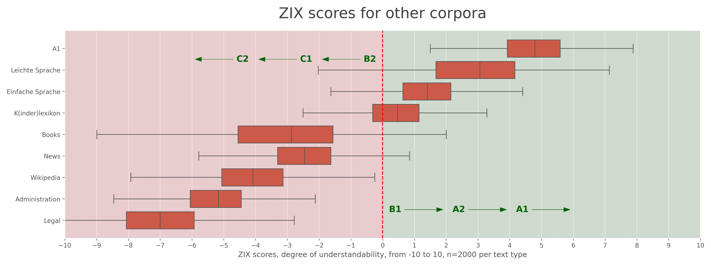

# Zürcher Verständlichkeitsindex (ZIX)
**Get a pragmatic indication how understandable a German text is.**

[](https://github.com/statistikZH/ml_understandability-index)
[](https://github.com/statistikZH/ml_understandability-index/stargazers)
[](https://github.com/statistikZH/ml_understandability-index/issues)
[](https://img.shields.io/github/issues-pr/statistikZH/ml_understandability-index) 
[](https://github.com/statistikZH/ml_understandability-index)
<a href="https://github.com/astral-sh/ruff"></a>

<details>
<summary>Contents</summary>

- [Usage](#usage)
- [What does the score mean?](#what-does-the-score-mean)
- [How does the score work?](#how-does-the-score-work)
- [Background](#background)
- [Licensing](#licensing)
- [Project team](#project-team)
- [Feedback and contributing](#feedback-and-contributing)

</details>

## Usage
- Create a [Conda](https://docs.anaconda.com/miniconda/) environment: `conda create -n zix python=3.9`
- Activate the environment: `conda activate zix`
- Install the required Spacy language model: `python -m spacy download de_core_news_sm`

**1. Install the ZIX as a package**
- `pip install git+https://github.com/machinelearningZH/zix_understandability-index`
- Alternatively clone the repo, change into the project directory and invoke: `python -m pip install .`
- Use the package like this:
```python
from zix.understandability import get_zix, get_cefr

text = """Die Schweiz, amtlich Schweizerische Eidgenossenschaft, 
ist ein föderalistischer, demokratischer Staat in Mitteleuropa. 
Er grenzt im Norden an Deutschland, im Osten an Österreich 
und Liechtenstein, im Süden an Italien und im Westen an Frankreich.
"""
zix_score = get_zix(text)
cefr = get_cefr(zix_score)
print(f"The text has an understandability score of: {zix_score:.1f}")
print(f"The text has a CEFR level of roughly: {cefr}")

>>> The text has a ZIX understandability score of: -2.3
>>> The text has a CEFR level of roughly: C1

```
**2. Explore the methodology in the notebooks**
- Clone this repo and change into the project directory.
- Install packages: `pip install -r requirements.txt`
- Run the notebooks. Open these either in an IDE like [Visual Studio Code](https://code.visualstudio.com/). Alternatively, you can use [Jupyter Notebook](https://docs.jupyter.org/en/latest/running.html) or [Jupyter Lab](https://jupyter.org/install).
- If you want to recreate the synthetic data that we generated with LLMs then you also need to create an `.env` file and input your API keys. You get them from your [OpenAI](https://platform.openai.com/api-keys) and [Anthropic](https://console.anthropic.com/settings/keys) account. The `.env` file should look like this:
```
    OPENAI_API_KEY=sk-...
    ANTHROPIC_API_KEY=sk-...
```
## What does the score mean?
- **Negative scores indicate difficult texts in the range of B2 to C2**. These texts will likely be **very hard to understand for many people** (this is classic «Behördendeutsch» or legal text territory...). 
- **Positive scores indicate a language level of B1 or easier**.

Here we plot the scores for our own data set.


Now that we have the ZIX metric we can assess other corpora and text types too.


> [!Important]
> This understandability index is meant as a **pragmatic measure**. It is **by no means exact or in regard to CEFR levels an official measure.** That being said, **the index serves us well in practice** in our context and for our text data. We treat it as an **indication** that gives us an idea if our editing goes in the right direction. 

Please note that **this index only works for German texts!**

## How does the score work?
- The score takes into account sentence lengths, the [readability metric RIX](https://hlasse.github.io/TextDescriptives/readability.html), the occurrence of common words and overlap with the standard CEFR vocabularies A1, A2 and B1.
- At the moment the score does **not** take into account other language properties that are essential for e.g. [Einfache Sprache](https://de.wikipedia.org/wiki/Einfache_Sprache) (B1 or easier, similar to «Plain English») or [Leichte Sprache](https://de.wikipedia.org/wiki/Leichte_Sprache) (A2, A1, similar to «Easy English») like use of passive voice, subjunctives, negations, etc. 

**For more details how we derived the index please have a look at the notebooks**, particularly `04_create_zix.ipynb`.

> [!Note]
> The index is slightly adjusted to Swiss German. Specifically we use `ss` instead of `ß` in our vocabulary lists. In practice this should not make a big difference. For High German text that actually contains `ß` the index will likely underestimate the understandability slightly with a difference of around 0.1.

## Background
Since no open **understandability** index seems to be available, we created our own. Many *readability* metrics exist. However, readability and understandability are related but not identical; a text can be readable yet hard to understand due to difficult vocabulary, passive voice, subjunctives etc.

**Our index goes beyond readability metrics by incorporating semantic features**, emphasizing common vocabulary. It also measures the overlap between the text's vocabulary and official standard [CEFR](https://www.coe.int/en/web/common-european-framework-reference-languages) vocabularies for German.

We recommend that you validate the index systematically with your text data to assess if it works well for your domain too. 

### Our steps to create the index
**Preparation**
- Create synthetic text samples in the CEFR language levels A1 to C2. We use 6 LLMs (GPT-4o/-mini and Claude Haiku and Sonnet, Phi-3 and Gemma 2) and create a total of 720 texts * 6 levels (4320 samples in total).
- Scrape [news bulletins from the cantonal administration](https://www.zh.ch/de/news-uebersicht.html?page=1&orderBy=new) as C1-level references.
- Use [legal decisions from a cantonal court](https://www.baurekursgericht-zh.ch/) and [the government council](https://www.zh.ch/de/politik-staat/gesetze-beschluesse/beschluesse-des-regierungsrates.html) as C2-level references.
- Include official CEFR vocabularies for A1, A2, and B1 from the [Goethe Institut](https://www.goethe.de/de/index.html).
- Compile a word frequency list of ~8k most used words in German.

**Creation of the index**
- Extract descriptive lingual features and readability metrics with [Spacy](https://spacy.io/) and [textdescriptives](https://github.com/HLasse/TextDescriptives).
- Calculate the ratio of standard CEFR vocabulary and a common word score.
- Explore feature distributions by text type.
- Model the data with a Gaussian Mixture Model to identify outliers.
- Model the data with a Ridge regressor, using estimated difficulty levels as the target variable.  
- Select a set of expressive features combining syntactical and semantical aspects. Add interaction terms.
- Map the predicted scores to a range centered around 0. Scores below 0 indicate difficult texts (B2 to C2). Scores above 0 indicate simpler texts (B1 to A1), more suitable for the general public.
- Refactor all into a separate package that is `pip` installable.

We developed this index [for our text simplification app](https://github.com/machinelearningZH/simply-simplify-language), that helps us rewrite complex administrative texts. The app displays the understandability of both the source text and simplified text. The index also allows us to measure the quality of various prompting techniques methods quantitatively. 

We think the index itself is useful as a standalone package too. Therefore we publish it here and make our methodology transparent. 

To the best of our knowledge there unfortunately are no open-source CEFR-labeled NLP datasets. Most available general datasets (Wikipedia, Books, news sources etc.) have too restrictive licensing for our case or are paid. Thus, we use text data from the cantonal administration and in addition create synthetic data.

## Licensing
- All code, the index formula and the synthetic text data are licensed under the MIT license. 
- Please be aware that the text data from the cantonal administration (court decisions, news bulletins, RRBs) is copyrighted and therefore is **NOT** included in the MIT licensing. This does not affect your usage of the index. You just shouldn't use the cantonal text data for anything else. 

## Project team
This is a project of [Team Data of the Statistical Office of the Canton of Zurich](https://www.zh.ch/de/direktion-der-justiz-und-des-innern/statistisches-amt/data.html). Responsible: Patrick Arnecke, Dominik Frefel and Marisol Keller.

## Feedback and contributing
We would love to hear from you. Please share your feedback and let us know how you use the code. You can [write an email](mailto:datashop@statistik.zh.ch) or share your ideas by opening an issue or a pull requests.

We use
- [Ruff](https://docs.astral.sh/ruff/) for linting and code formatting with default settings
- and [pytest](https://docs.pytest.org/en/stable/) for unit testing.

